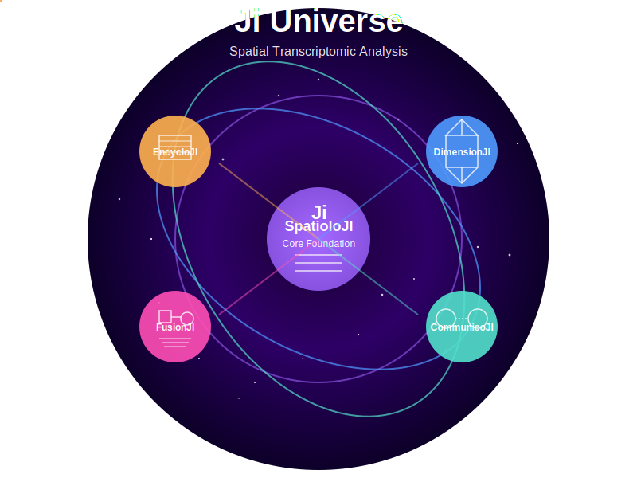

# Ji Universe: Advanced Spatial Transcriptomics Analysis



Ji Universe is a comprehensive suite of specialized Python packages designed for cutting-edge spatial transcriptomic analysis. Our ecosystem offers powerful tools for researchers to explore, analyze, and visualize spatial gene expression data with unprecedented depth and precision.

## Core Packages

### SpatioloJI
**Core Foundation for Spatial Transcriptomics**

SpatioloJI serves as the foundational cornerstone of the Ji Universe, providing essential infrastructure that powers all other packages in the ecosystem. This core library implements fundamental workflows and data structures optimized for spatial transcriptomic analysis.

**Key Capabilities:**
- Data preprocessing and quality control for spatial transcriptomics
- Flexible data structures for multi-modal spatial datasets
- Visualization of spatial feature patterns in dots/polygons
- Customizable spatial statistics and spatial dependency testing
- Comprehensive documentation and tutorials
- Integration with popular single-cell analysis frameworks (Scanpy)
- Storage of spatial statistics information

---

### DimensionJI
**Multidimensional Spatial Transcriptomics Analysis**

DimensionJI extends spatial analysis into higher dimensions, enabling researchers to analyze complex 3D tissue architectures and temporal dynamics in spatial transcriptomic data.

**Key Capabilities:**
- 3D reconstruction of tissue architecture from 2D spatial slices
- Registration and alignment of consecutive tissue sections
- Time-series analysis of spatial gene expression data (4D analysis)
- Trajectory inference accounting for both spatial and temporal dimensions
- Visualization tools for exploring 3D/4D spatial transcriptomics data
- Spatial dimensionality reduction techniques preserving local structure
- Differential expression testing in 3D spatial contexts
- Integration of multiple z-stack layers with spatial coordinates
- Developmental analysis across spatial and temporal dimensions
- Mathematical modeling of gene expression dynamics in 3D/4D space

---

### CommunicoJI
**Spatial Cell-Cell Communication Analysis**

CommunicoJI specializes in analyzing intercellular communication patterns using spatial information, enabling researchers to uncover how cells interact within the tissue microenvironment.

**Key Capabilities:**
- Ligand-receptor interaction analysis with spatial context
- Identification of spatially restricted communication channels
- Cell-cell interaction networks based on proximity and expression
- Spatial mapping of signaling pathways across tissue regions
- Statistical methods for identifying significant spatial communication
- Visualization of communication patterns in tissue context
- Prediction of cell-cell interaction strength based on distance and expression
- Integration of diffusion models for secreted factors
- Comparative analysis of communication networks across conditions
- Identification of spatially organized cellular communities

---

### FusionJI
**Integrated Image and Transcriptomic Analysis**

FusionJI bridges the gap between imaging data and spatial transcriptomics, providing powerful tools to integrate and analyze these complementary data types.

**Key Capabilities:**
- Co-registration of histology/fluorescence images with transcriptomic data
- Feature extraction from imaging data for multi-modal analysis
- Integration of cell morphology with gene expression profiles
- Deep learning models for image-transcriptome correlation
- Joint dimensionality reduction of imaging and expression features
- Visualization of multi-modal spatial data
- Prediction of gene expression from tissue images
- Cell segmentation algorithms optimized for spatial transcriptomics
- Multi-modal clustering incorporating both image and expression data
- Transfer learning between imaging modalities and expression data

---

### EncycloJI
**Comprehensive Collection of Spatial Transcriptomic Tools**

EncycloJI serves as a curated repository of established spatial transcriptomic analysis methods, providing standardized interfaces, benchmarking capabilities, and comprehensive documentation.

**Key Capabilities:**
- Unified API for accessing diverse spatial analysis methods
- Comprehensive benchmarking of algorithms on reference datasets
- Detailed documentation of method assumptions and limitations
- Parameter optimization tools for spatial analysis methods
- Performance comparison across different data types and technologies
- Method recommendation system based on data characteristics
- Reproducible workflows for standard analysis tasks
- Continuous integration of newly published methods
- Standardized visualization of method outputs
- Ground truth datasets for validating spatial analysis methods


## Contributing

We welcome contributions from the community!

## Citation

If you use Ji Universe in your research, please cite our paper:

```
@article{jiuniverse2025,
  title={Ji Universe: A comprehensive framework for spatial transcriptomic analysis},
  author={Ji Universe Team},
  journal={Nature Methods},
  year={2025},
  volume={},
  pages={}
}
```

## License

Ji Universe is released under the MIT License.
